# Backend Architecture

## System Architecture Diagram

```mermaid
graph TD
    subgraph "API Layer"
        A[API Gateway] --> B[Authentication Service]
        A --> C[Booking Service]
        A --> D[Admin Service]
        A --> E[Public Service]
    end

    subgraph "Authentication Service"
        B --> B1[JWT Token Management]
        B --> B2[User Authentication]
        B --> B3[Role Management]
        B --> B4[Session Handling]
    end

    subgraph "Booking Service"
        C --> C1[Appointment Management]
        C --> C2[Service Management]
        C --> C3[Staff Management]
        C --> C4[Customer Management]
        C --> C5[Availability Checker]
        C --> C6[Conflict Resolution]
    end

    subgraph "Admin Service"
        D --> D1[Business Hours Management]
        D --> D2[Analytics Dashboard]
        D --> D3[System Settings]
        D --> D4[Notification Center]
        D --> D5[Staff Management]
        D --> D6[Service Management]
    end

    subgraph "Database Layer"
        DB[(PostgreSQL)] --> DB1[Users]
        DB --> DB2[Bookings]
        DB --> DB3[Services]
        DB --> DB4[Staff]
        DB --> DB5[Business Hours]
        DB --> DB6[Settings]
        DB --> DB7[Notifications]
    end

    subgraph "External Services"
        ES1[Email Service] --> ES1.1[SMTP Server]
        ES2[SMS Service] --> ES2.1[SMS Provider]
        ES3[Payment Service] --> ES3.1[Payment Gateway]
    end

    subgraph "Security Layer"
        SL1[JWT Filter]
        SL2[Role-Based Access Control]
        SL3[Rate Limiting]
        SL4[CORS Configuration]
    end

    %% Service Connections
    B --> DB1
    C --> DB2
    C --> DB3
    C --> DB4
    D --> DB5
    D --> DB6
    D --> DB7

    %% External Service Connections
    B --> ES1
    C --> ES1
    C --> ES2
    C --> ES3
    D --> ES1
    D --> ES2

    %% Security Connections
    A --> SL1
    SL1 --> SL2
    SL2 --> SL3
    SL3 --> SL4
```

## Component Descriptions

### 1. API Layer
- **API Gateway**: Entry point for all requests, handles routing and request validation
- **Authentication Service**: Manages user authentication and authorization
- **Booking Service**: Handles all booking-related operations
- **Admin Service**: Manages administrative functions
- **Public Service**: Handles public-facing endpoints

### 2. Authentication Service
- **JWT Token Management**: Handles token generation, validation, and refresh
- **User Authentication**: Manages user login and registration
- **Role Management**: Controls user roles and permissions
- **Session Handling**: Manages user sessions and security

### 3. Booking Service
- **Appointment Management**: Handles booking creation, modification, and cancellation
- **Service Management**: Manages available services and their details
- **Staff Management**: Handles staff availability and assignments
- **Customer Management**: Manages customer information and history
- **Availability Checker**: Validates booking time slots
- **Conflict Resolution**: Handles booking conflicts and overlaps

### 4. Admin Service
- **Business Hours Management**: Controls operating hours and special dates
- **Analytics Dashboard**: Provides business insights and reports
- **System Settings**: Manages system-wide configurations
- **Notification Center**: Handles all system notifications
- **Staff Management**: Controls staff accounts and permissions
- **Service Management**: Manages service offerings and pricing

### 5. Database Layer
- **Users**: Stores user accounts and authentication data
- **Bookings**: Stores all booking records
- **Services**: Stores service definitions and pricing
- **Staff**: Stores staff information and availability
- **Business Hours**: Stores operating hours and exceptions
- **Settings**: Stores system configuration
- **Notifications**: Stores notification templates and history

### 6. External Services
- **Email Service**: Handles email notifications
- **SMS Service**: Manages SMS notifications
- **Payment Service**: Processes payments and refunds

### 7. Security Layer
- **JWT Filter**: Validates JWT tokens
- **Role-Based Access Control**: Enforces access permissions
- **Rate Limiting**: Prevents abuse
- **CORS Configuration**: Manages cross-origin requests

## Data Flow

1. **Authentication Flow**
   - Client request → API Gateway → Authentication Service → JWT Token
   - Token validation → Role verification → Access granted/denied

2. **Booking Flow**
   - Client request → API Gateway → Booking Service
   - Availability check → Conflict resolution → Booking creation
   - Notification dispatch → Confirmation

3. **Admin Flow**
   - Admin request → API Gateway → Admin Service
   - Permission check → Operation execution → Database update
   - Notification dispatch → Response

## Security Considerations

1. **Authentication**
   - JWT-based stateless authentication
   - Token refresh mechanism
   - Password hashing with BCrypt

2. **Authorization**
   - Role-based access control
   - Resource-level permissions
   - API endpoint protection

3. **Data Protection**
   - Input validation
   - SQL injection prevention
   - XSS protection
   - CSRF protection

4. **Rate Limiting**
   - Request throttling
   - IP-based limiting
   - User-based limiting

## Scalability Considerations

1. **Horizontal Scaling**
   - Stateless services
   - Load balancing
   - Database replication

2. **Performance**
   - Database indexing
   - Query optimization
   - Caching strategy

3. **Monitoring**
   - Health checks
   - Performance metrics
   - Error tracking 