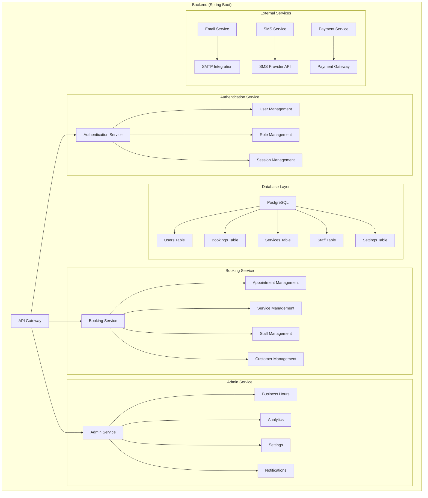

# Backend Architecture

## Architecture Diagram



## Detailed Implementation Guide

### 1. Project Structure
```
backend/
├── src/
│   ├── main/
│   │   ├── java/
│   │   │   ├── com/nastrih/
│   │   │   │   ├── config/           # Configuration classes
│   │   │   │   ├── controller/       # REST controllers
│   │   │   │   ├── dto/             # Data Transfer Objects
│   │   │   │   ├── entity/          # JPA entities
│   │   │   │   ├── repository/      # JPA repositories
│   │   │   │   ├── service/         # Business logic
│   │   │   │   ├── security/        # Security configuration
│   │   │   │   └── exception/       # Custom exceptions
│   │   │   └── resources/
│   │   │       ├── application.yml  # Main configuration
│   │   │       └── application-dev.yml # Dev configuration
```

### 2. Database Schema with Detailed Properties

```sql
-- Users Table
CREATE TABLE users (
    id UUID PRIMARY KEY DEFAULT gen_random_uuid(),
    email VARCHAR(255) NOT NULL UNIQUE,
    password VARCHAR(255) NOT NULL,
    first_name VARCHAR(100),
    last_name VARCHAR(100),
    phone VARCHAR(20),
    role VARCHAR(50) NOT NULL DEFAULT 'USER',
    is_active BOOLEAN DEFAULT true,
    created_at TIMESTAMP DEFAULT CURRENT_TIMESTAMP,
    updated_at TIMESTAMP DEFAULT CURRENT_TIMESTAMP
);

-- Services Table
CREATE TABLE services (
    id UUID PRIMARY KEY DEFAULT gen_random_uuid(),
    name VARCHAR(255) NOT NULL,
    description TEXT,
    duration INTEGER NOT NULL, -- in minutes
    price DECIMAL(10,2) NOT NULL,
    is_active BOOLEAN DEFAULT true,
    created_at TIMESTAMP DEFAULT CURRENT_TIMESTAMP,
    updated_at TIMESTAMP DEFAULT CURRENT_TIMESTAMP
);

-- Staff Table
CREATE TABLE staff (
    id UUID PRIMARY KEY DEFAULT gen_random_uuid(),
    user_id UUID NOT NULL REFERENCES users(id),
    bio TEXT,
    is_active BOOLEAN DEFAULT true,
    created_at TIMESTAMP DEFAULT CURRENT_TIMESTAMP,
    updated_at TIMESTAMP DEFAULT CURRENT_TIMESTAMP
);

-- Staff Services (Many-to-Many)
CREATE TABLE staff_services (
    staff_id UUID REFERENCES staff(id),
    service_id UUID REFERENCES services(id),
    PRIMARY KEY (staff_id, service_id)
);

-- Business Hours Table
CREATE TABLE business_hours (
    id UUID PRIMARY KEY DEFAULT gen_random_uuid(),
    day_of_week INTEGER NOT NULL, -- 1-7 (Monday-Sunday)
    open_time TIME NOT NULL,
    close_time TIME NOT NULL,
    is_closed BOOLEAN DEFAULT false,
    created_at TIMESTAMP DEFAULT CURRENT_TIMESTAMP,
    updated_at TIMESTAMP DEFAULT CURRENT_TIMESTAMP
);

-- Bookings Table
CREATE TABLE bookings (
    id UUID PRIMARY KEY DEFAULT gen_random_uuid(),
    user_id UUID NOT NULL REFERENCES users(id),
    service_id UUID NOT NULL REFERENCES services(id),
    staff_id UUID NOT NULL REFERENCES staff(id),
    booking_date DATE NOT NULL,
    start_time TIME NOT NULL,
    end_time TIME NOT NULL,
    status VARCHAR(50) NOT NULL DEFAULT 'PENDING',
    notes TEXT,
    created_at TIMESTAMP DEFAULT CURRENT_TIMESTAMP,
    updated_at TIMESTAMP DEFAULT CURRENT_TIMESTAMP
);

-- Settings Table
CREATE TABLE settings (
    id UUID PRIMARY KEY DEFAULT gen_random_uuid(),
    key VARCHAR(255) NOT NULL UNIQUE,
    value TEXT NOT NULL,
    created_at TIMESTAMP DEFAULT CURRENT_TIMESTAMP,
    updated_at TIMESTAMP DEFAULT CURRENT_TIMESTAMP
);
```

### 3. Entity Classes

```java
// User.java
@Entity
@Table(name = "users")
@Data
@NoArgsConstructor
@AllArgsConstructor
public class User {
    @Id
    @GeneratedValue(strategy = GenerationType.UUID)
    private UUID id;

    @Column(nullable = false, unique = true)
    private String email;

    @Column(nullable = false)
    private String password;

    private String firstName;
    private String lastName;
    private String phone;

    @Enumerated(EnumType.STRING)
    @Column(nullable = false)
    private UserRole role = UserRole.USER;

    private boolean isActive = true;

    @Column(nullable = false)
    private LocalDateTime createdAt;

    @Column(nullable = false)
    private LocalDateTime updatedAt;

    @PrePersist
    protected void onCreate() {
        createdAt = LocalDateTime.now();
        updatedAt = LocalDateTime.now();
    }

    @PreUpdate
    protected void onUpdate() {
        updatedAt = LocalDateTime.now();
    }
}

// Service.java
@Entity
@Table(name = "services")
@Data
@NoArgsConstructor
@AllArgsConstructor
public class Service {
    @Id
    @GeneratedValue(strategy = GenerationType.UUID)
    private UUID id;

    @Column(nullable = false)
    private String name;

    private String description;

    @Column(nullable = false)
    private Integer duration;

    @Column(nullable = false)
    private BigDecimal price;

    private boolean isActive = true;

    @Column(nullable = false)
    private LocalDateTime createdAt;

    @Column(nullable = false)
    private LocalDateTime updatedAt;

    @ManyToMany(mappedBy = "services")
    private Set<Staff> staff = new HashSet<>();
}

// Staff.java
@Entity
@Table(name = "staff")
@Data
@NoArgsConstructor
@AllArgsConstructor
public class Staff {
    @Id
    @GeneratedValue(strategy = GenerationType.UUID)
    private UUID id;

    @OneToOne
    @JoinColumn(name = "user_id", nullable = false)
    private User user;

    private String bio;
    private boolean isActive = true;

    @ManyToMany
    @JoinTable(
        name = "staff_services",
        joinColumns = @JoinColumn(name = "staff_id"),
        inverseJoinColumns = @JoinColumn(name = "service_id")
    )
    private Set<Service> services = new HashSet<>();

    @Column(nullable = false)
    private LocalDateTime createdAt;

    @Column(nullable = false)
    private LocalDateTime updatedAt;
}

// Booking.java
@Entity
@Table(name = "bookings")
@Data
@NoArgsConstructor
@AllArgsConstructor
public class Booking {
    @Id
    @GeneratedValue(strategy = GenerationType.UUID)
    private UUID id;

    @ManyToOne
    @JoinColumn(name = "user_id", nullable = false)
    private User user;

    @ManyToOne
    @JoinColumn(name = "service_id", nullable = false)
    private Service service;

    @ManyToOne
    @JoinColumn(name = "staff_id", nullable = false)
    private Staff staff;

    @Column(nullable = false)
    private LocalDate bookingDate;

    @Column(nullable = false)
    private LocalTime startTime;

    @Column(nullable = false)
    private LocalTime endTime;

    @Enumerated(EnumType.STRING)
    @Column(nullable = false)
    private BookingStatus status = BookingStatus.PENDING;

    private String notes;

    @Column(nullable = false)
    private LocalDateTime createdAt;

    @Column(nullable = false)
    private LocalDateTime updatedAt;
}
```

### 4. Repository Interfaces

```java
@Repository
public interface UserRepository extends JpaRepository<User, UUID> {
    Optional<User> findByEmail(String email);
    boolean existsByEmail(String email);
}

@Repository
public interface ServiceRepository extends JpaRepository<Service, UUID> {
    List<Service> findByIsActiveTrue();
}

@Repository
public interface StaffRepository extends JpaRepository<Staff, UUID> {
    List<Staff> findByIsActiveTrue();
    List<Staff> findByServicesId(UUID serviceId);
}

@Repository
public interface BookingRepository extends JpaRepository<Booking, UUID> {
    List<Booking> findByUserId(UUID userId);
    List<Booking> findByStaffId(UUID staffId);
    List<Booking> findByBookingDate(LocalDate date);
    boolean existsByStaffIdAndBookingDateAndStartTimeBetween(
        UUID staffId, LocalDate date, LocalTime start, LocalTime end);
}
```

### 5. Service Layer Examples

```java
@Service
@Transactional
@RequiredArgsConstructor
public class BookingService {
    private final BookingRepository bookingRepository;
    private final StaffRepository staffRepository;
    private final ServiceRepository serviceRepository;

    public Booking createBooking(BookingRequest request) {
        // Validate availability
        if (!isTimeSlotAvailable(request)) {
            throw new BookingException("Time slot is not available");
        }

        // Create booking
        Booking booking = new Booking();
        booking.setUser(request.getUser());
        booking.setService(serviceRepository.findById(request.getServiceId())
            .orElseThrow(() -> new EntityNotFoundException("Service not found")));
        booking.setStaff(staffRepository.findById(request.getStaffId())
            .orElseThrow(() -> new EntityNotFoundException("Staff not found")));
        booking.setBookingDate(request.getDate());
        booking.setStartTime(request.getStartTime());
        booking.setEndTime(calculateEndTime(request.getStartTime(), 
            booking.getService().getDuration()));

        return bookingRepository.save(booking);
    }

    private boolean isTimeSlotAvailable(BookingRequest request) {
        return !bookingRepository.existsByStaffIdAndBookingDateAndStartTimeBetween(
            request.getStaffId(),
            request.getDate(),
            request.getStartTime(),
            calculateEndTime(request.getStartTime(), 
                serviceRepository.findById(request.getServiceId())
                    .orElseThrow(() -> new EntityNotFoundException("Service not found"))
                    .getDuration())
        );
    }
}
```

### 6. Controller Examples

```java
@RestController
@RequestMapping("/api/bookings")
@RequiredArgsConstructor
public class BookingController {
    private final BookingService bookingService;

    @PostMapping
    public ResponseEntity<Booking> createBooking(@Valid @RequestBody BookingRequest request) {
        return ResponseEntity.ok(bookingService.createBooking(request));
    }

    @GetMapping("/{id}")
    public ResponseEntity<Booking> getBooking(@PathVariable UUID id) {
        return ResponseEntity.ok(bookingService.getBooking(id));
    }

    @GetMapping("/user/{userId}")
    public ResponseEntity<List<Booking>> getUserBookings(@PathVariable UUID userId) {
        return ResponseEntity.ok(bookingService.getUserBookings(userId));
    }

    @PutMapping("/{id}/cancel")
    public ResponseEntity<Booking> cancelBooking(@PathVariable UUID id) {
        return ResponseEntity.ok(bookingService.cancelBooking(id));
    }
}
```

### 7. Security Configuration

```java
@Configuration
@EnableWebSecurity
@RequiredArgsConstructor
public class SecurityConfig {
    private final JwtAuthenticationFilter jwtAuthFilter;
    private final UserDetailsService userDetailsService;

    @Bean
    public SecurityFilterChain securityFilterChain(HttpSecurity http) throws Exception {
        http
            .csrf(csrf -> csrf.disable())
            .authorizeHttpRequests(auth -> auth
                .requestMatchers("/api/auth/**").permitAll()
                .requestMatchers("/api/public/**").permitAll()
                .requestMatchers("/api/admin/**").hasRole("ADMIN")
                .anyRequest().authenticated()
            )
            .sessionManagement(session -> session
                .sessionCreationPolicy(SessionCreationPolicy.STATELESS)
            )
            .addFilterBefore(jwtAuthFilter, UsernamePasswordAuthenticationFilter.class);

        return http.build();
    }

    @Bean
    public PasswordEncoder passwordEncoder() {
        return new BCryptPasswordEncoder();
    }
}
```

### 8. Application Properties

```yaml
# application.yml
spring:
  datasource:
    url: jdbc:postgresql://localhost:5432/nastrih
    username: ${DB_USERNAME}
    password: ${DB_PASSWORD}
  jpa:
    hibernate:
      ddl-auto: validate
    properties:
      hibernate:
        dialect: org.hibernate.dialect.PostgreSQLDialect
        format_sql: true
    show-sql: true

  security:
    jwt:
      secret: ${JWT_SECRET}
      expiration: 86400000 # 24 hours

server:
  port: 8080
  servlet:
    context-path: /api

logging:
  level:
    org.springframework.security: DEBUG
    com.nastrih: DEBUG
```

### 9. Dependencies (pom.xml)

```xml
<dependencies>
    <!-- Spring Boot Starters -->
    <dependency>
        <groupId>org.springframework.boot</groupId>
        <artifactId>spring-boot-starter-web</artifactId>
    </dependency>
    <dependency>
        <groupId>org.springframework.boot</groupId>
        <artifactId>spring-boot-starter-data-jpa</artifactId>
    </dependency>
    <dependency>
        <groupId>org.springframework.boot</groupId>
        <artifactId>spring-boot-starter-security</artifactId>
    </dependency>
    <dependency>
        <groupId>org.springframework.boot</groupId>
        <artifactId>spring-boot-starter-validation</artifactId>
    </dependency>

    <!-- Database -->
    <dependency>
        <groupId>org.postgresql</groupId>
        <artifactId>postgresql</artifactId>
    </dependency>

    <!-- JWT -->
    <dependency>
        <groupId>io.jsonwebtoken</groupId>
        <artifactId>jjwt-api</artifactId>
        <version>0.11.5</version>
    </dependency>

    <!-- Lombok -->
    <dependency>
        <groupId>org.projectlombok</groupId>
        <artifactId>lombok</artifactId>
        <optional>true</optional>
    </dependency>
</dependencies>
```

This detailed implementation guide provides all the necessary components for a junior developer to start building the backend. The code includes:
- Complete database schema with all necessary tables and relationships
- Entity classes with JPA annotations
- Repository interfaces for data access
- Service layer examples with business logic
- Controller examples for REST endpoints
- Security configuration
- Application properties
- Required dependencies

Would you like me to add more specific examples or explain any part in more detail? 