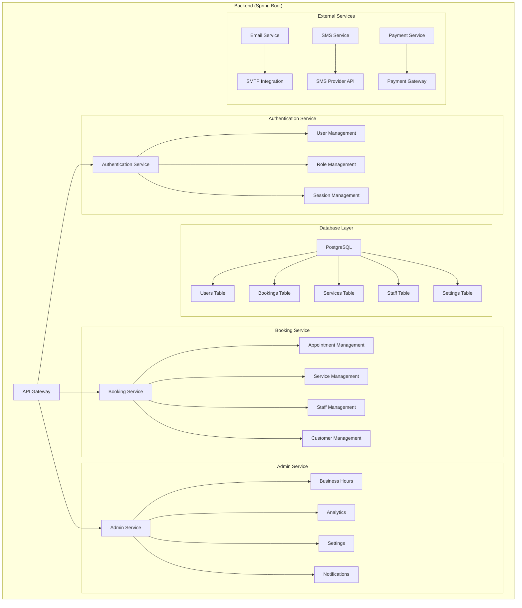

# Backend Architecture

## Architecture Diagram



## Implementation Guide

### 1. Project Structure
```
backend/
├── src/
│   ├── main/
│   │   ├── java/
│   │   │   ├── auth/          # Authentication
│   │   │   ├── booking/       # Booking management
│   │   │   ├── admin/         # Admin operations
│   │   │   └── common/        # Shared utilities
│   │   └── resources/
│   │       └── application.yml # Configuration
```

### 2. Database Schema
```sql
-- Core Tables
CREATE TABLE users (
    id UUID PRIMARY KEY,
    email VARCHAR(255) UNIQUE,
    role VARCHAR(50),
    created_at TIMESTAMP
);

CREATE TABLE bookings (
    id UUID PRIMARY KEY,
    user_id UUID,
    service_id UUID,
    staff_id UUID,
    datetime TIMESTAMP,
    status VARCHAR(50),
    created_at TIMESTAMP
);

CREATE TABLE services (
    id UUID PRIMARY KEY,
    name VARCHAR(255),
    duration INTEGER,
    price DECIMAL,
    created_at TIMESTAMP
);

CREATE TABLE staff (
    id UUID PRIMARY KEY,
    user_id UUID,
    services UUID[],
    created_at TIMESTAMP
);
```

### 3. API Endpoints
```
# Authentication
POST /api/auth/login
POST /api/auth/register
GET /api/auth/me

# Bookings
GET /api/bookings
POST /api/bookings
PUT /api/bookings/{id}
DELETE /api/bookings/{id}

# Admin
GET /api/admin/services
POST /api/admin/services
PUT /api/admin/services/{id}
GET /api/admin/staff
POST /api/admin/staff
PUT /api/admin/staff/{id}
```

### 4. Security Considerations
- JWT-based authentication
- Role-based access control
- Input validation
- Rate limiting
- CORS configuration

### 5. Technology Stack
- Spring Boot
- Spring Security
- Spring Data JPA
- PostgreSQL
- JWT for authentication
- SMTP for email
- SMS provider integration
- Payment gateway integration

### 6. Key Features
- User authentication and authorization
- Booking management
- Service management
- Staff management
- Business hours configuration
- Email notifications
- SMS notifications
- Payment processing
- Analytics and reporting 