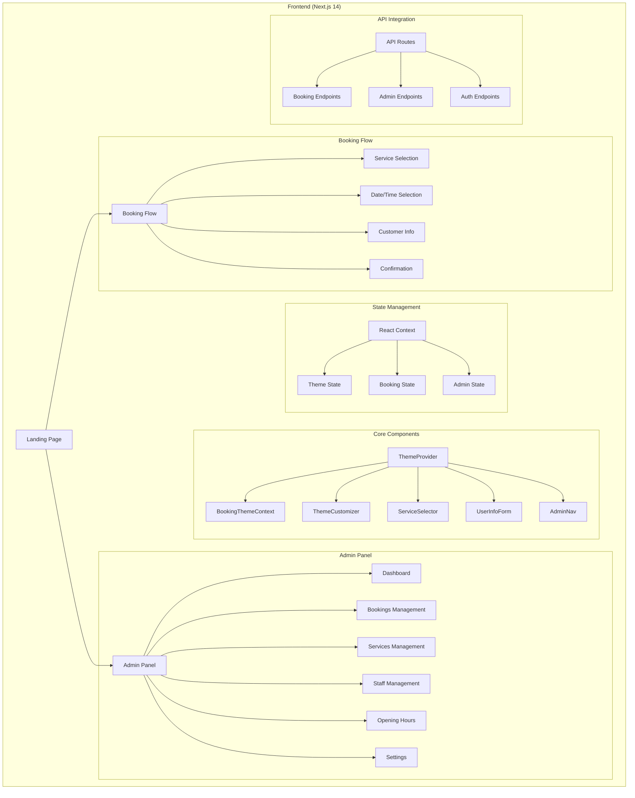

# Frontend Architecture

## Architecture Diagram



## Implementation Guide

### 1. Project Structure
```
front/
├── src/
│   ├── app/                 # Next.js app router pages
│   │   ├── rezervace/      # Booking flow
│   │   ├── admin/         # Admin panel
│   │   └── setup/         # Initial setup
│   ├── components/         # Reusable components
│   │   ├── booking/       # Booking components
│   │   ├── admin/        # Admin components
│   │   └── shared/       # Shared components
│   ├── contexts/          # React contexts
│   ├── lib/              # Utility functions
│   └── styles/           # Global styles
```

### 2. Key Components
- `BookingThemeProvider`: Theme management
- `ServiceSelector`: Service selection interface
- `UserInfoForm`: Customer information collection
- `AdminNav`: Admin panel navigation
- `OpeningHoursManager`: Business hours management

### 3. State Management
- React Context for theme and booking state
- Session storage for booking flow
- API integration with backend services

### 4. Technology Stack
- Next.js 14 with App Router
- TypeScript
- Tailwind CSS
- React Context for state management
- Next-Auth for authentication
- Framer Motion for animations

### 5. Key Features
- Multi-step booking flow
- Real-time availability checking
- Theme customization
- Responsive design
- Admin dashboard
- Service management
- Staff management
- Business hours configuration 